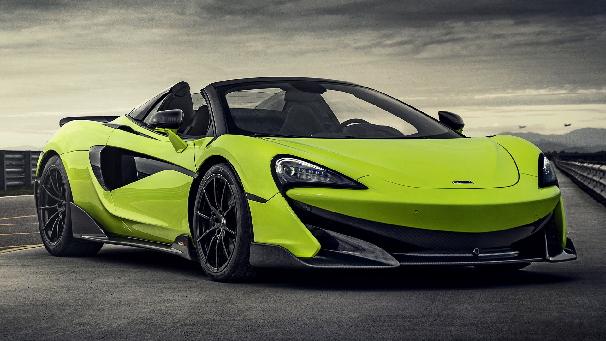
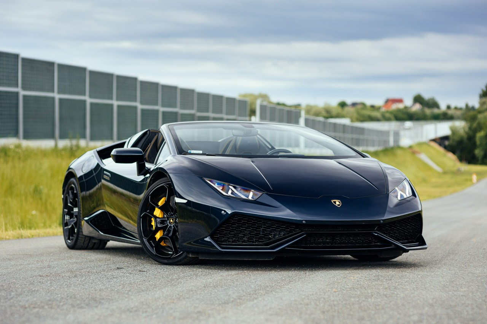
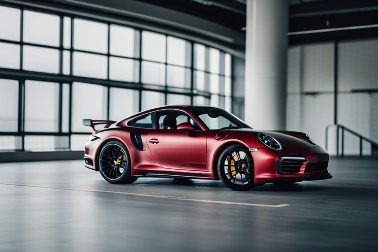

# McLaren 600LT
# Overview and Key Features
The McLaren 600LT (Longtail) is a high-performance supercar built by McLaren Automotive, introduced in 2018 as part of the McLaren Sports Series. The "LT" designation stands for "Longtail," symbolizing its track-focused engineering, reduced weight, and aerodynamic enhancements. It is available as both a coupe and a spider (convertible) variant.

# Key Specifications
Performance:
- Engine: 3.8-liter twin-turbocharged V8.
- Power Output: 592 hp (600 PS) and 457 lb-ft of torque.
- Transmission: 7-speed dual-clutch automatic.
- 0-60 mph: 2.8 seconds.
- Top Speed: 204 mph (328 km/h).

# Weight and Build:
Dry Weight: 1,247 kg (2,749 lbs), making it one of the lightest cars in its class.
Extensive use of carbon fiber for the body and aerodynamic components, contributing to the car's agility and reduced weight.
Chassis and Handling:
Features suspension improvements inspired by the McLaren 720S for sharper handling.
A lower ride height and wider track improve cornering stability.
Lightweight brakes and Pirelli P Zero Trofeo R tires enhance track performance.

# Design and Aerodynamics
- Exterior:
Aggressive design with a longtail silhouette for improved downforce and cooling.
Carbon-fiber front splitter, side sills, rear diffuser, and a fixed rear wing.
Lightweight, top-exit exhausts for a distinct appearance and reduced weight.

- Interior:
Stripped-down cabin for weight savings with optional Senna-inspired carbon-fiber bucket seats.
Alcantara upholstery and minimalist design to focus on the driving experience.
Optional features include lightweight air conditioning and infotainment for track enthusiasts prioritizing performance.

# Track-Focused Enhancements
The 600LT is built for those who love pushing limits on the track:
Over 23% of its components differ from the McLaren 570S.
Superior braking performance and cooling systems to endure track abuse.
Aerodynamic downforce: Generates 220.5 pounds (100 kg) of downforce at 155 mph for exceptional stability.

# Why It's Special
The McLaren 600LT offers a perfect combination of lightweight construction, powerful performance, and precision handling. Whether you're carving through mountain roads or attacking a racetrack, it delivers an exhilarating experience for drivers who demand the very best in automotive performance.

---

# Lamborghini Huracán
# Overview and Key Features
The Lamborghini Huracán is a mid-engine supercar introduced in 2014 as the successor to the Lamborghini Gallardo. It is known for its aggressive design, breathtaking performance, and advanced driving technology. The Huracán comes in multiple variants, including coupe, spider, and track-focused versions.

# Key Specifications
-Engine: 5.2-liter naturally aspirated V10.
- Power Output:
  - Standard Huracán EVO: 630 hp (640 PS).
  - Huracán STO (track-focused): 631 hp.
- Transmission: 7-speed dual-clutch automatic.
- 0-60 mph: 2.8-3.2 seconds (depending on the variant).
- Top Speed: Over 202 mph (325 km/h).

# Chassis and Handling
- Advanced all-wheel-drive system (available in rear-wheel drive for certain variants like the Huracán EVO RWD).
- Lightweight aluminum and carbon-fiber hybrid chassis for superior agility and handling.
- Lamborghini Integrated Vehicle Dynamics (LDVI): Advanced system to adapt and optimize the car's behavior based on driving conditions.

# Design and Features
- Exterior
Signature sharp and angular Lamborghini design.
LED headlights and taillights with Y-shaped light signatures.
Aerodynamic elements like large air intakes, splitters, and a rear diffuser for high downforce.
Optional customization via Lamborghini’s Ad Personam program.
- Interior
Luxurious interior with high-quality materials, including Alcantara and leather.
Digital driver display with performance data and customization options.
Infotainment system with Apple CarPlay, navigation, and advanced connectivity.

# Why It’s Special
The Lamborghini Huracán combines Lamborghini’s signature bold design with raw, naturally aspirated V10 power and advanced technology. Whether on the road or the track, it delivers an unforgettable driving experience with its mix of power, sound, and handling.

---

# Porsche 911 Turbo S
# Overview and Key Features
The Porsche 911 Turbo S represents the pinnacle of performance and luxury in Porsche’s iconic 911 lineup. Known for its blistering speed, advanced engineering, and everyday usability, the Turbo S is a true supercar that offers unparalleled driving dynamics with exceptional refinement.

# Key Specifications
Performance:
- Engine: 3.8-liter twin-turbocharged flat-six engine.
- Power Output: 640 hp and 590 lb-ft of torque.
- Transmission: 8-speed Porsche Doppelkupplung (PDK) dual-clutch automatic.
- 0-60 mph: 2.6 seconds (Coupe).
- Top Speed: 205 mph (330 km/h).
- Drivetrain: All-wheel drive for exceptional traction and stability.

# Chassis and Handling:
- Active Aerodynamics: Adjustable front splitter and rear spoiler improve high-speed stability and downforce.
- Porsche Active Suspension Management (PASM): Continuously adjusts damping for optimal ride and handling.
- Rear-Wheel Steering: Enhances agility at low speeds and stability at high speeds.
- Porsche Ceramic Composite Brakes (PCCB): For precise and fade-free braking.

# Design and Aerodynamics
- Exterior:
Iconic 911 silhouette with wider bodywork for a muscular stance.
Distinctive LED Matrix headlights and taillight strip that spans the width of the car.
Larger air intakes and active cooling systems to enhance aerodynamics and engine performance.
20-inch front and 21-inch rear wheels with center-locking hubs for a motorsport-inspired look.
- Interior:
Luxurious cabin with premium materials like leather, carbon fiber, and aluminum.
Sport Chrono Package standard, with a mode selector on the steering wheel for different driving styles.
10.9-inch Porsche Communication Management (PCM) touchscreen for infotainment and navigation.
Advanced Bose Surround Sound System or optional Burmester High-End Audio System for an immersive experience.

# Technology and Innovations
Porsche Traction Management (PTM): Intelligent all-wheel drive distributes power efficiently to all four wheels.
Adaptive Cruise Control: Combines comfort with safety, maintaining a set distance from the car ahead.
Wet Mode: Detects wet road surfaces and adjusts vehicle settings for enhanced grip and safety.
Overboost Function: Temporarily increases engine torque for faster acceleration during spirited driving.

# Why It's Special
The Porsche 911 Turbo S is the ultimate expression of the 911, combining Porsche’s racing heritage with cutting-edge technology. It offers:

- Unmatched Performance: One of the quickest production cars available today.
- Timeless Design: Continuation of the classic 911 aesthetics with modern refinements.
- Track-Ready Capabilities: Designed to dominate on both the road and the racetrack.

